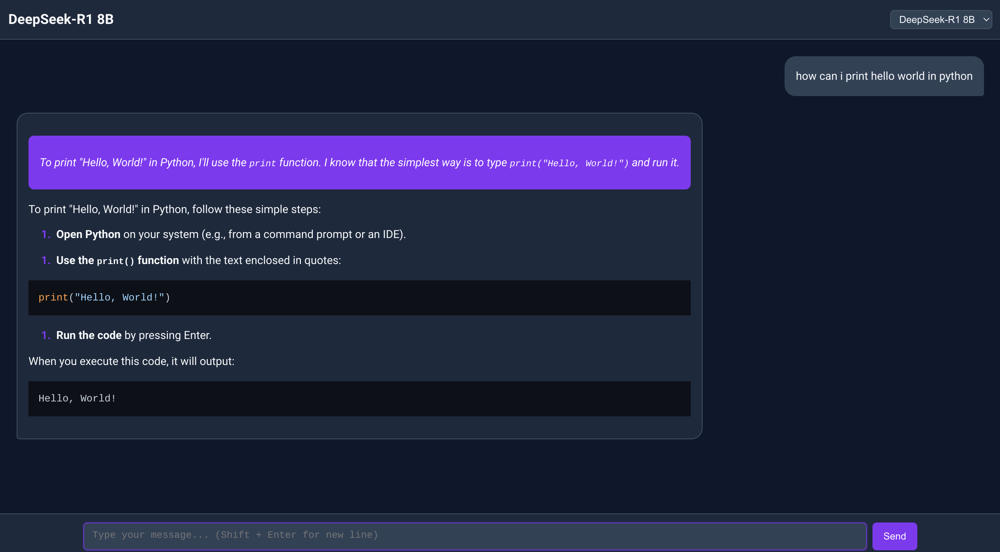

# DeepSeek Desktop Application


This project is a desktop application that utilizes the DeepSeek Model 8B for high-performance search functionalities. The application processes queries and retrieves relevant results from large datasets using an advanced machine learning model. It offers a simple, user-friendly interface for both Windows and Linux users, making it easy to perform searches based on the DeepSeek Model.

## Features



* Efficient Search: Uses DeepSeek Model 8B to provide accurate search results from large datasets
* Cross-Platform Compatibility: Available for Windows, macOS, and Linux users
* User-Friendly Interface: Clean and intuitive UI for easy navigation and search
* Real-Time Learning: The model adapts to user interactions to improve future search results
* Powerful Query Processing: Handles complex queries and provides context-aware search results

## Prerequisites

Before running this project, ensure you have the following:
* DeepSeek Model 8B: Download the DeepSeek Model 8B before proceeding with installation. You can find the download link in the releases page ([DeepSeek Model 8B](https://ollama.com/library/deepseek-r1))
* Linux: AppImage or DEB packages for installation
* Windows/macOS: Node.js installed for running the app locally

## Installation

### Linux

We provide AppImage and DEB packages for easy installation on Linux:

1. Download the AppImage or DEB file from the releases page (replace with actual link to releases).

2. For AppImage:
   * Make the AppImage file executable:
   ```bash
   chmod +x DeepSeekAppImageFile.AppImage
   ```
   * Run the application:
   ```bash
   ./DeepSeekAppImageFile.AppImage
   ```

3. For DEB:
   * Install the DEB package:
   ```bash
   sudo dpkg -i deepseek-package.deb
   ```
   * After installation, launch the app from your applications menu.

### Windows & macOS

1. Clone the repository:
```bash
git clone https://github.com/yigitcankzl/deepseek-desktop-application.git
```

2. Navigate to the project directory:
```bash
cd deepseek-desktop-application
```

3. Install dependencies:
   * Using npm:
   ```bash
   npm install
   ```
   * Using yarn:
   ```bash
   yarn install
   ```

4. Run the application:
   * Using npm:
   ```bash
   npm start
   ```
   * Using yarn:
   ```bash
   yarn start
   ```

## Usage

1. Launch the application
2. Enter a search query in the search bar
3. The DeepSeek Model 8B processes the query and displays the most relevant results
4. Customize search behavior through the settings menu

## Technologies Used

* Electron: Framework for building cross-platform desktop applications using web technologies
* React: JavaScript library for building user interfaces
* Node.js: JavaScript runtime for backend operations
* DeepSeek Model 8B: The machine learning model for performing high-accuracy search

## Contributing

1. Fork the repository
2. Create a new branch: `git checkout -b feature-name`
3. Commit your changes: `git commit -am 'Add feature'`
4. Push to the branch: `git push origin feature-name`
5. Create a new Pull Request

## License

This project is licensed under the MIT License - see the LICENSE file for details.
